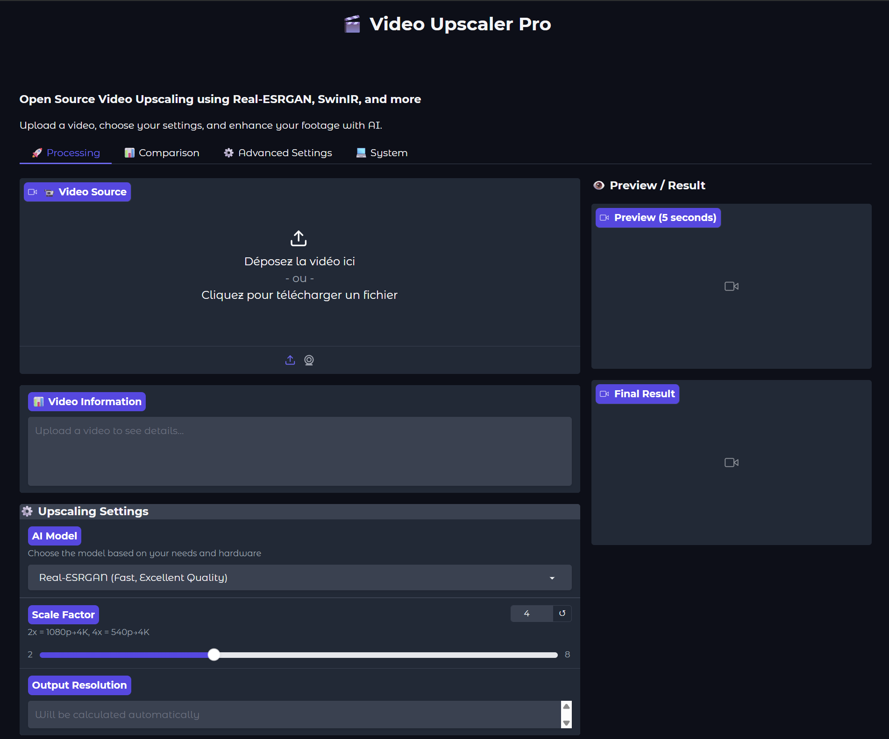

# V2UP 🎬 Video Upscaler Pro

[](LICENSE)
[](https://www.python.org/downloads/)
[](https://pytorch.org/)

Open source video upscaling application using AI models like Real-ESRGAN, SwinIR, and RIFE. Achieve quality comparable to Topaz Video Enhance AI with a simple, user-friendly interface powered by Gradio.

<p align="center">
  
</p>

## ✨ Features

### Currently Working (v0.2.0)

- **🚀 Real-ESRGAN Upscaling** ✅
  - 2x, 4x, and 8x upscaling
  - Fast, excellent quality for realistic videos
  - Automatic model weight downloads
  - Tile-based processing for large videos

- **🎞️ RIFE Frame Interpolation** ✅
  - 2x, 3x, and 4x FPS interpolation
  - Optical flow-based smooth interpolation
  - Combine with upscaling for enhanced quality
  - 30fps → 60fps, 120fps support

- **⚡ Smart Performance** ✅
  - Automatic GPU/CPU detection
  - VRAM usage optimization
  - Dynamic batch size adjustment
  - FP16 support for faster processing
  - CPU fallback mode

- **🎯 Testing Utilities** ✅
  - Built-in test video generator
  - Multiple test patterns (shapes, text, checkerboard, etc.)
  - Quick testing script included

- **🖥️ User-Friendly Interface** ✅
  - Simple drag-and-drop video upload
  - Real-time preview (5 seconds)
  - Live progress tracking with ETA
  - System information display
  - Before/after comparison

### Coming Soon

- **SwinIR**: Maximum quality upscaling
- **SeedVR2**: Temporal coherence for flicker-free results
- **DAIN**: Advanced frame interpolation
- **Quality Metrics**: PSNR, SSIM, flickering scores
- **Batch Processing**: Process multiple videos at once

## 📋 Requirements

### Minimum Requirements (CPU Mode)
- **Python 3.10, 3.11, or 3.12 (RECOMMENDED)** ⚠️ Python 3.13 has compatibility issues
- 32 GB RAM
- Intel i7 / AMD Ryzen 7 or better (8+ cores)
- 50 GB free disk space

### Recommended Requirements (GPU Mode)
- **Python 3.10, 3.11, or 3.12 (RECOMMENDED)** ⚠️ Python 3.13 has compatibility issues
- 16 GB RAM (32 GB recommended)
- NVIDIA GPU with 12+ GB VRAM (RTX 3060 or better)
- 50 GB free disk space
- CUDA 11.8 or higher (for NVIDIA GPU acceleration)

**⚠️ Python 3.13 Compatibility**: Python 3.13 has known issues with AI model dependencies (BasicSR). Please use Python 3.10-3.12 for the best experience. If you must use Python 3.13, see [PYTHON_313_WORKAROUND.md](PYTHON_313_WORKAROUND.md) for manual installation instructions.

### Supported Platforms
- ✅ Windows 10/11
- ✅ Linux (Ubuntu 20.04+, Debian, etc.)
- ✅ macOS 12+ (Apple Silicon and Intel)

## 🚀 Quick Start

### Windows

1. **Download or clone the repository**
   ```bash
   git clone https://github.com/mikecastrodemaria/v2up-video-upscaler-pro.git
   cd v2up-video-upscaler-pro
   ```

2. **Run the installer**
   ```bash
   install.bat
   ```

3. **Start the application**
   ```bash
   start.bat
   ```

The application will open automatically in your browser at `http://localhost:7860`.

### Linux / macOS

1. **Download or clone the repository**
   ```bash
   git clone https://github.com/mikecastrodemaria/v2up-video-upscaler-pro.git
   cd v2up-video-upscaler-pro
   ```

2. **Run the installer**
   ```bash
   chmod +x install.sh
   ./install.sh
   ```

3. **Start the application**
   ```bash
   ./start.sh
   ```

The application will open automatically in your browser at `http://localhost:7860`.

## 📖 Detailed Installation

### Prerequisites

#### Windows
- Install Python 3.10+ from [python.org](https://www.python.org/downloads/)
  - ⚠️ During installation, check "Add Python to PATH"
- (Optional) Install [CUDA Toolkit 11.8+](https://developer.nvidia.com/cuda-downloads) for GPU support

#### Linux (Ubuntu/Debian)
```bash
sudo apt update
sudo apt install python3 python3-pip python3-venv
sudo apt install ffmpeg  # For video processing
```

For NVIDIA GPU support:
```bash
# Install CUDA toolkit
# Follow instructions at: https://developer.nvidia.com/cuda-downloads
```

#### macOS
```bash
# Install Homebrew if not already installed
/bin/bash -c "$(curl -fsSL https://raw.githubusercontent.com/Homebrew/install/HEAD/install.sh)"

# Install Python
brew install python@3.10

# Install FFmpeg
brew install ffmpeg
```

### Manual Installation

If the automatic installer doesn't work, you can install manually:

```bash
# Create virtual environment
python3 -m venv venv

# Activate virtual environment
# On Windows:
venv\Scripts\activate.bat
# On Linux/macOS:
source venv/bin/activate

# Upgrade pip
pip install --upgrade pip

# Install dependencies
pip install -r requirements.txt
```

## 🎮 Usage

### Basic Workflow

1. **Upload Video**
   - Drag and drop your video or click to browse
   - Supported formats: MP4, AVI, MKV, MOV, WEBM

2. **Choose Settings**
   - Select AI model (Real-ESRGAN recommended for most cases)
   - Choose scale factor (2x, 4x, or 8x)
   - Optionally enable FPS interpolation

3. **Preview**
   - Click "Preview" to process the first 5 seconds
   - Check the quality before processing the full video

4. **Process**
   - Click "Process Full Video" to upscale your entire video
   - Monitor progress and ETA
   - Download the result when complete

### Model Selection Guide

| Model | Best For | Speed | VRAM | Quality |
|-------|----------|-------|------|---------|
| **Real-ESRGAN** | General use, realistic videos | Fast | 4-8 GB | Excellent |
| **SwinIR** | Photo-realistic, detailed content | Slow | 6-10 GB | Maximum |
| **SeedVR2** | Videos with temporal artifacts | Medium | 16-24 GB | Excellent + Coherence |

### FPS Interpolation

- **RIFE (Available Now)**: Optical flow-based interpolation, works well for most content (24→60 fps, 30→120 fps)
- **DAIN (Coming Soon)**: Advanced interpolation for complex scenes with depth

### Testing the Application

We provide a complete testing utility to help you get started:

```bash
# Run the test script (generates test videos and starts app)
python test_app.py
```

This will:
1. Check all dependencies
2. Generate test videos in `test_videos/` directory
3. Display system information
4. Launch the application

Or generate test videos manually:

```bash
# Generate all test videos
python -m tests.test_video_generator --output-dir test_videos

# Generate specific type
python -m tests.test_video_generator --type shapes --duration 10

# Custom resolution and FPS
python -m tests.test_video_generator --resolution 1280x720 --fps 60
```

Available test video types:
- `shapes`: Moving shapes (good for testing upscaling)
- `text`: Scrolling text (tests detail preservation)
- `checker`: Checkerboard animation (tests fine details)
- `bars`: Color bars with animation (tests color accuracy)
- `resolution`: Resolution test pattern (tests sharpness)
- `all`: Generate all test videos

## ⚙️ Configuration

### Advanced Settings

Access the "Advanced Settings" tab in the application to configure:

- **Temporal Coherence**: Choose method for reducing flickering
- **Processing Device**: Force GPU or CPU mode
- **Batch Size**: Adjust memory usage vs speed
- **Output Format**: Choose video codec and quality

### Configuration File

Create a `config.yaml` file in the project root for persistent settings:

```yaml
# Video Upscaler Pro Configuration
default_model: "realesrgan"
default_scale: 4
device: "auto"  # auto, cuda, cpu
batch_size: 8
use_fp16: true
output_format: "mp4"
output_quality: 18  # CRF value
```

## 🐛 Troubleshooting

### Common Issues

#### "CUDA out of memory"
**Solution**:
- Reduce scale factor (try 2x instead of 4x)
- Close other GPU applications
- Reduce batch size in Advanced Settings
- Use CPU mode (slower but works)

#### "ModuleNotFoundError"
**Solution**:
- Run the installer again: `install.bat` or `./install.sh`
- Ensure virtual environment is activated
- Check Python version: `python --version` (must be 3.10+)

#### Application won't start
**Solution**:
- Check if port 7860 is already in use
- Review logs in the terminal
- Ensure all dependencies installed: `pip list`

#### Slow processing on CPU
**Solution**:
- This is normal - CPU is 10-20x slower than GPU
- Consider using a cloud GPU service
- Process shorter videos or lower resolution

### Getting Help

- 📖 Check the [Wiki](https://github.com/mikecastrodemaria/v2up-video-upscaler-pro/wiki)
- 🐛 [Report bugs](https://github.com/mikecastrodemaria/v2up-video-upscaler-pro/issues)
- 💬 [Join discussions](https://github.com/mikecastrodemaria/v2up-video-upscaler-pro/discussions)

## 🏗️ Project Structure

```
video-upscaler-pro/
├── app.py                  # Main entry point
├── requirements.txt        # Python dependencies
├── install.bat             # Windows installer
├── install.sh             # Linux/macOS installer
├── start.bat              # Windows start script
├── start.sh               # Linux/macOS start script
├── src/
│   ├── models/            # AI model wrappers
│   ├── processors/        # Video processing pipeline
│   ├── ui/                # Gradio interface
│   │   └── gradio_app.py  # Main UI
│   └── utils/             # Helper functions
├── tests/                 # Unit tests
├── docs/                  # Documentation
└── benchmarks/            # Performance benchmarks
```

## 🔬 Development

### Setting Up Development Environment

```bash
# Clone the repository
git clone https://github.com/mikecastrodemaria/v2up-video-upscaler-pro.git
cd v2up-video-upscaler-pro

# Install in development mode
pip install -e .

# Install development dependencies
pip install pytest black flake8
```

### Running Tests

```bash
# Run all tests
pytest

# Run specific test
pytest tests/test_video_processor.py

# Run with coverage
pytest --cov=src
```

### Code Style

This project uses:
- **Black** for code formatting
- **Flake8** for linting

```bash
# Format code
black src/

# Check linting
flake8 src/
```

## 📊 Benchmarks

Performance benchmarks on different hardware:

| Hardware | Video (1080p→4K) | Time | Model |
|----------|------------------|------|-------|
| RTX 4090 | 1 minute | 45 sec | Real-ESRGAN |
| RTX 3060 | 1 minute | 4 min | Real-ESRGAN |
| RTX 2060 | 1 minute | 6 min | Real-ESRGAN |
| CPU (i9) | 1 minute | 45 min | Real-ESRGAN |

*See [benchmarks/](benchmarks/) for detailed results.*

## 🤝 Contributing

Contributions are welcome! Please see [CONTRIBUTING.md](CONTRIBUTING.md) for guidelines.

### Areas for Contribution

- 🎨 UI/UX improvements
- 🧠 New AI model integrations
- 🐛 Bug fixes
- 📖 Documentation
- 🌍 Translations

## 📝 License

This project is licensed under the Apache License 2.0 - see the [LICENSE](LICENSE) file for details.

## 🙏 Acknowledgments

This project builds upon amazing open source work:

- [Real-ESRGAN](https://github.com/xinntao/Real-ESRGAN) by xinntao
- [SwinIR](https://github.com/JingyunLiang/SwinIR) by JingyunLiang
- [RIFE](https://github.com/hzwer/Practical-RIFE) by hzwer
- [Gradio](https://gradio.app/) by Gradio team
- [PyTorch](https://pytorch.org/) by Meta AI

## 🌟 Star History

If you find this project useful, please consider giving it a star!

## 📧 Contact

- GitHub: [@mikecastrodemaria](https://github.com/mikecastrodemaria)
- Email: your.email@example.com

---

<p align="center">
  Made with ❤️ by the open source community
</p>
